<p align="center">
  
</p>

<h1 align="center">pg·modern</h1>

<p align="center">
  A modern, self-hosted Postgres console for the homelab.<br />
  It finds your databases in Docker and <code>.env</code> files, keeps the credentials encrypted, and opens everything read-only.
</p>

<p align="center">
  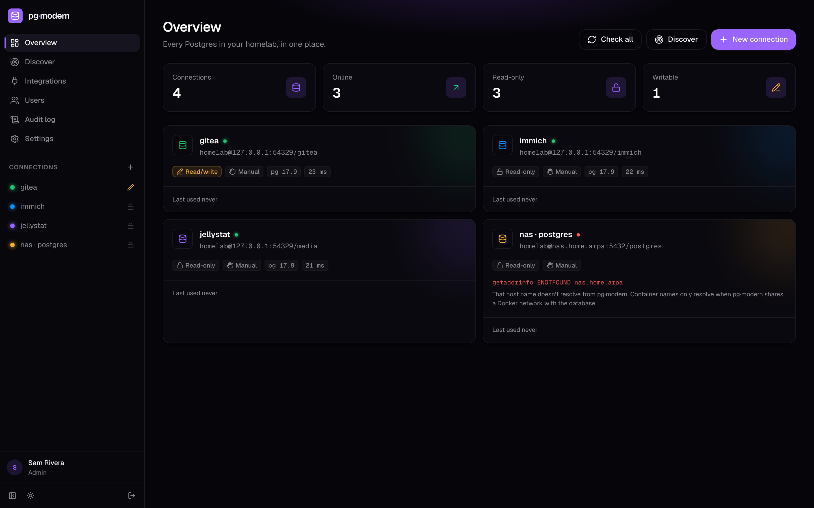
</p>

## Features

- **Discover**: finds Postgres containers on your Docker hosts, connection strings in app containers, credentials in `.env`, `compose.yaml` and Terraform files, and every project managed by [Arcane](https://getarcane.app) through its API. Import them in one click.
- **Encrypted storage**: connection passwords are sealed with AES-256-GCM. Discovered secrets never reach the browser.
- **Read-only by default**: every query runs in a `READ ONLY` transaction that is always rolled back. Writes are opt-in per connection, and destructive statements still ask first.
- **Browse**: schema tree; filter, sort, page and export tables; inspect JSON cells; view columns, indexes, constraints, foreign keys and triggers.
- **Query**: SQL editor with schema-aware autocomplete. Run the statement under the cursor (`⌘↵`) or the whole script (`⇧⌘↵`), cancel long queries, keep a per-connection history, and export results to CSV or JSON.
- **Server overview**: version, size, sessions, cache hit ratio, largest tables, extensions, and whether your role is a superuser.
- **Users and SSO**: sign in with any OIDC provider (Authentik, Authelia, Keycloak, Pocket ID, Google, …). Accounts can be created automatically for matching emails. *Admins* manage everything; *viewers* can browse and query but are always read-only.
- **Light and dark** themes, and multi-arch images (`amd64`, `arm64`).

## Getting started

### Docker Compose (recommended)

```sh
mkdir pg-modern && cd pg-modern
curl -fsSLO https://raw.githubusercontent.com/vitafortis/pg-modern/main/compose.yaml
# edit the /opt/stacks volume to point at where your stacks live
docker compose up -d
```

Open `http://<your-host>:3030`. A short setup wizard creates the admin account (name, email, password) and optionally connects Arcane and your stacks folders. Then go to **Discover**:

1. **Containers** lists every Postgres it found through the Docker API. Use **Running only** and **Reachable only** to cut the noise.
2. **Files** scans the mounted stacks folder. You can add more folders right there.
3. Tick what you want, rename anything you like, and **Import**. New connections are read-only.

The default [`compose.yaml`](compose.yaml) runs pg·modern next to a [read-only Docker socket proxy](https://github.com/Tecnativa/docker-socket-proxy), so it never gets the raw socket.

### `docker run`

```sh
docker run -d --name pg-modern \
  -p 3030:3000 \
  -v pg-modern-data:/data \
  -v /opt/stacks:/stacks:ro -e PGM_SCAN_PATHS=/stacks \
  -v /var/run/docker.sock:/var/run/docker.sock:ro \
  --group-add "$(stat -c %g /var/run/docker.sock)" \
  --add-host host.docker.internal:host-gateway \
  ghcr.io/vitafortis/pg-modern:latest
```

The container runs as an unprivileged user. `--group-add` gives it read access to the Docker socket. Leave the socket mount out if you don't want container discovery.

### Using Arcane?

If [Arcane](https://getarcane.app) manages your stacks, you don't need to mount anything. Through Arcane's API, pg·modern reads every container (environment variables, published ports, networks) and every project's compose file and `.env`, across every environment (host) Arcane manages. That includes databases that aren't Arcane projects.

1. In Arcane, go to **Settings → API Keys** and create a key with only these read-only permissions: `environments:list`, `projects:list`, `projects:read`, `containers:list` and `containers:read`. Without the two container permissions, only Arcane projects are scanned.
2. In pg·modern, open **Integrations → Arcane**, enter your Arcane URL (e.g. `http://arcane.lan:3552`) and the key, then **Test** and **Connect**. Or set `PGM_ARCANE_URL` and `PGM_ARCANE_API_KEY`.
3. Open **Discover → Arcane**.

Published ports resolve to each environment's host address. The API key is stored encrypted, like database passwords.

If you'd rather scan the files directly, run pg·modern on the Arcane host and mount the projects folder at the same path, e.g. `- /opt/projects:/opt/projects:ro`. If Arcane writes `.env` files readable only by root, the container's non-root user can't read them; that's another reason to prefer the API.

### Reaching your databases

pg·modern connects from inside its own container, so for each database it needs a route.

- **Published ports** (`5432:5432`) work out of the box through `host.docker.internal`.
- **Unpublished databases** need pg·modern on the same Docker network. Add the network to the `pg-modern` service (see the comments in `compose.yaml`).
- **Remote hosts** just need the host and port.

Discovery probes every address it knows for a server and preselects the first one that answers.

## Users and SSO

pg·modern has two roles:

| | Admin | Viewer |
| --- | --- | --- |
| Browse tables, run queries | ✓ | ✓ (always read-only, even on read/write connections) |
| Add, edit and delete connections | ✓ | |
| Discover, Settings, Users | ✓ | |

The first admin is created by the setup wizard, or headlessly with `PGM_ADMIN_EMAIL` and `PGM_ADMIN_PASSWORD`, which create it on first start and skip the wizard. Add more people from the **Users** page, or let them sign in through SSO. Everyone can change their name, email and password under **My account** (click your name in the sidebar).

**Upgrading from a version without accounts?** Your old password still works. Sign in as **`admin`**, and pg·modern asks once for your name and email; after that, sign in with your email.

### OIDC

Create an OIDC client in your identity provider (confidential, authorization code flow) with this redirect URI:

```
https://<your pg-modern host>/auth/oidc/callback
```

Then open **Integrations → Single sign-on** in pg·modern:

1. Pick your provider, then fill in the issuer URL, client ID and secret.
2. Click **Test**, then **Enable single sign-on**.
3. Optionally set who gets an account automatically and who becomes an admin.
4. Once SSO works, you can turn off password sign-in on the same card.

The redirect URI to register is shown there, with a copy button. Or configure it with environment variables, which then lock the UI fields:

```yaml
environment:
  PGM_OIDC_ISSUER: https://auth.example.com/application/o/pg-modern/
  PGM_OIDC_CLIENT_ID: pg-modern
  PGM_OIDC_CLIENT_SECRET: ${PGM_OIDC_CLIENT_SECRET}
  PGM_OIDC_NAME: Authentik                       # login button label
  PGM_OIDC_AUTO_CREATE: "*@example.com,friend@gmail.com"
  PGM_OIDC_ADMIN_EMAILS: you@example.com
  # PGM_LOCAL_LOGIN: disabled                    # SSO only, once it works
```

If SSO breaks while password sign-in is off, start pg·modern with `PGM_LOCAL_LOGIN=enabled` to get the password form back.

When someone signs in:

1. If their SSO identity is already linked to an account, they're in.
2. Otherwise, if an admin added their email on the Users page, that account is linked on first login.
3. Otherwise, if their email matches `PGM_OIDC_AUTO_CREATE`, an account is created: admin when they also match `PGM_OIDC_ADMIN_EMAILS`, otherwise `PGM_OIDC_DEFAULT_ROLE` (viewer).
4. Anyone else is turned away.

Emails the provider marks as unverified are rejected. An email that's already linked to one SSO identity can't be claimed by another. The flow uses PKCE, state and nonce. Disabling a user or changing their role signs them out immediately.

Behind a reverse proxy, set `PROTOCOL_HEADER` and `HOST_HEADER` so the callback URL is built with your public address, or set a redirect URI override under **Advanced**.

## Images

Images are published to the GitHub Container Registry for `linux/amd64` and `linux/arm64`:

| Tag | Tracks |
| --- | --- |
| `ghcr.io/vitafortis/pg-modern:latest` | the latest build of `main` |
| `ghcr.io/vitafortis/pg-modern:1`, `:1.2`, `:1.2.3` | releases (`v*` tags) |
| `ghcr.io/vitafortis/pg-modern:sha-abc1234` | a specific commit |

To build it yourself: `docker build -t pg-modern .`

## Screenshots

| | |
| --- | --- |
| 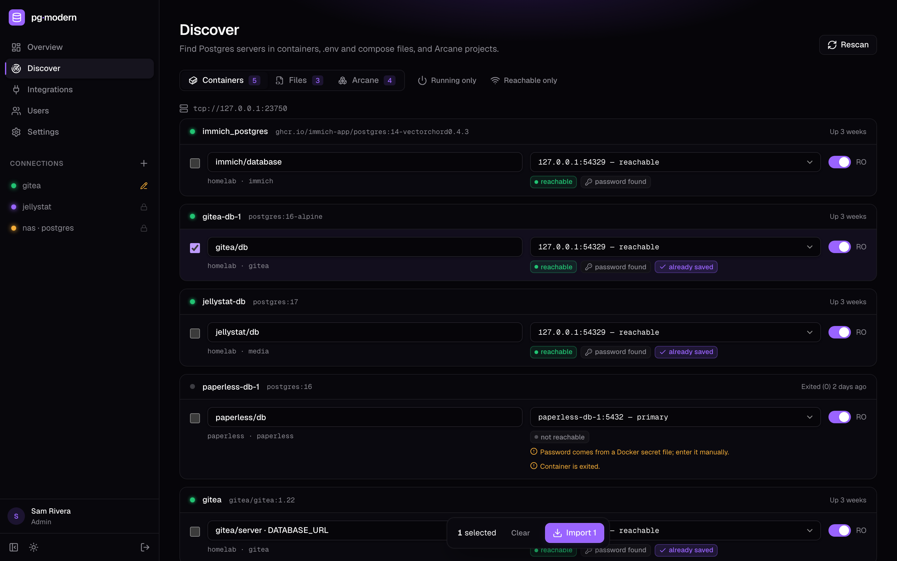 | 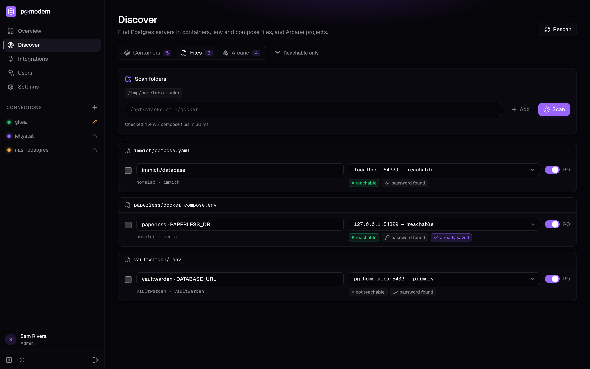 |
| **Discover**: containers, with reachability and saved-state badges | **Discover**: `.env` and compose files |
| 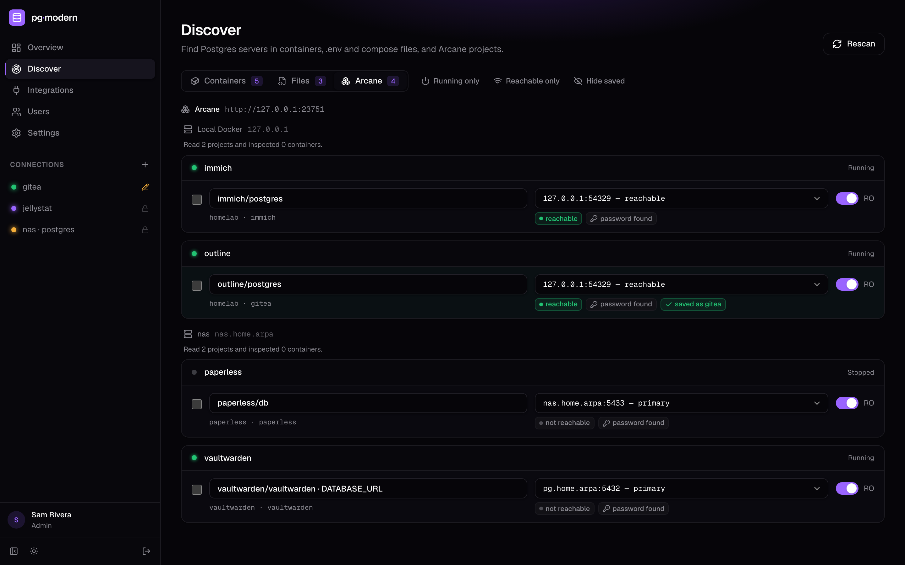 | 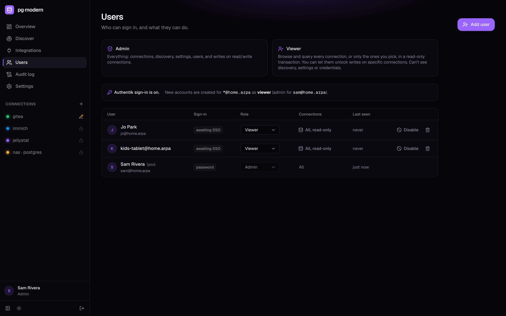 |
| **Discover**: Arcane projects across environments | **Users**: admins and read-only viewers |
| 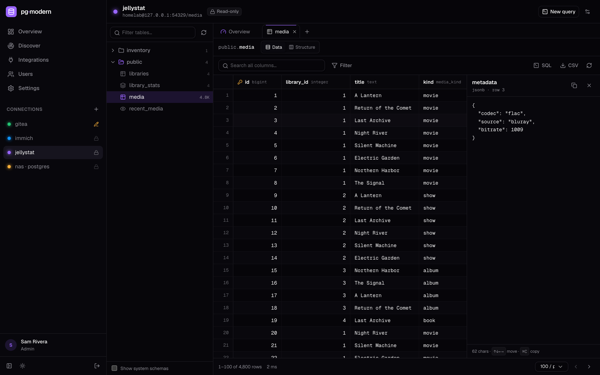 | 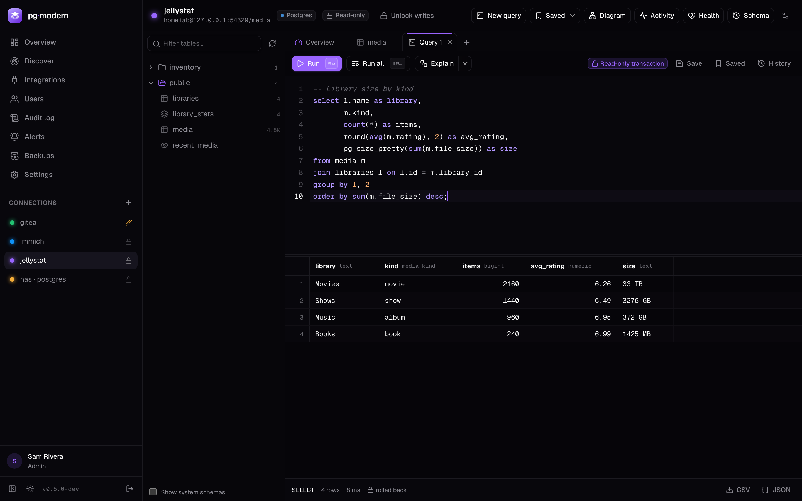 |
| **Browse**: virtualized grid with a JSON cell inspector | **Query**: runs in a read-only transaction that is rolled back |
| 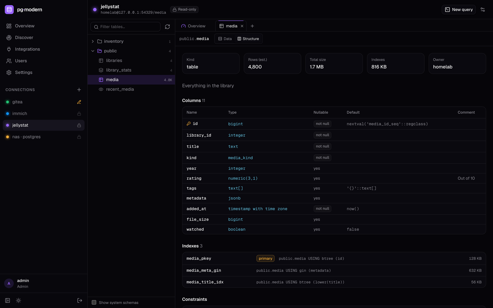 | 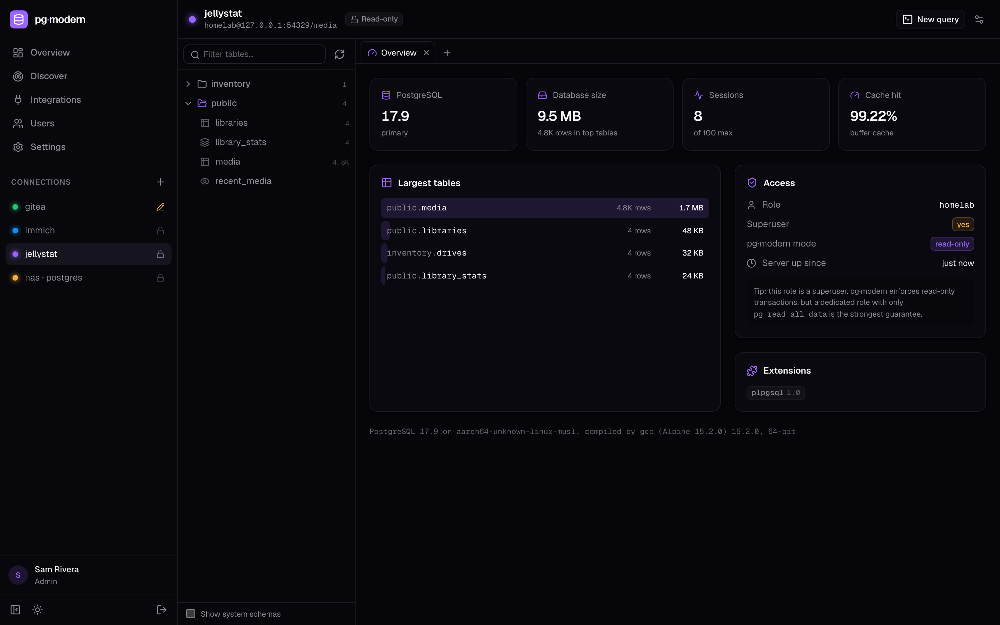 |
| **Structure**: columns, indexes, constraints | **Server overview** |
| 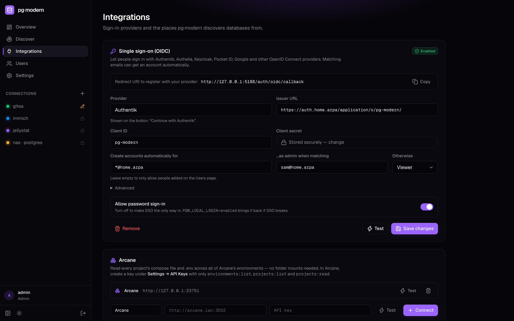 | 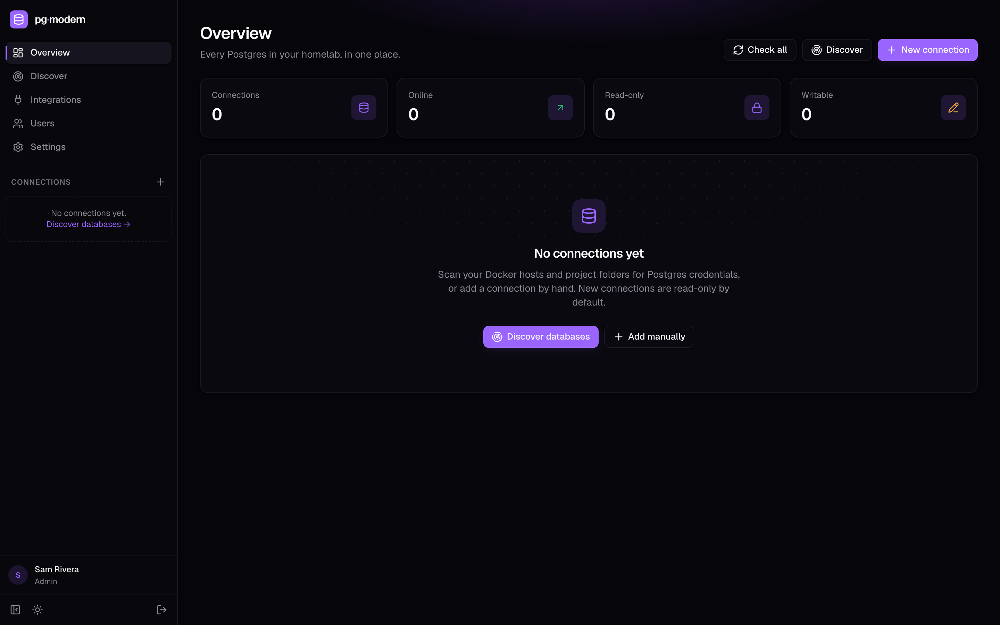 |
| **Integrations**: SSO, Arcane, Docker and folders | **Sign in**: SSO or password |
| 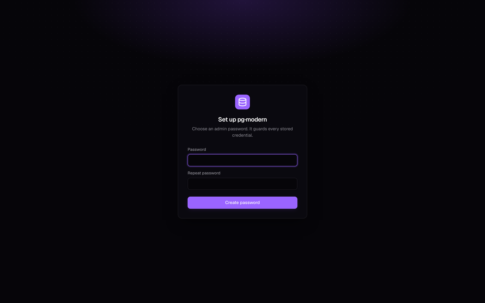 | 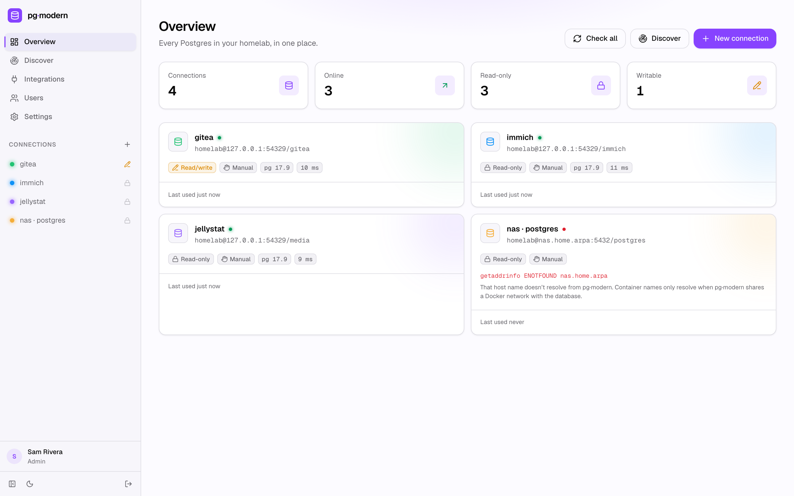 |
| **First run**: setup wizard | **Light theme** |

## Configuration

| Variable | Default | |
| --- | --- | --- |
| `PGM_DATA_DIR` | `./data` (`/data` in the image) | Encrypted SQLite store and key file |
| `PGM_SECRET_KEY` | — | Master secret. Unset means a random key is generated in `secret.key` |
| `PGM_SCAN_PATHS` | — | Comma-separated folders to scan (more can be added under Integrations) |
| `PGM_SCAN_DEPTH` | `6` | How deep to recurse into scan folders |
| `PGM_DOCKER_HOSTS` | local socket | `unix://…` or `tcp://host:2375`, comma-separated |
| `PGM_ARCANE_URL`, `PGM_ARCANE_API_KEY` | — | An Arcane instance to read projects from (or add it under Integrations) |
| `PGM_STATEMENT_TIMEOUT_MS` | `30000` | Per-statement timeout |
| `PGM_MAX_ROWS` | `5000` | Rows returned per result; the rest are truncated |
| `PGM_ADMIN_EMAIL`, `PGM_ADMIN_PASSWORD`, `PGM_ADMIN_NAME` | — | Create the first admin on start instead of using the setup wizard |
| `PGM_AUTH` | — | `disabled` skips the login screen (trusted networks only) |
| `PGM_LOCAL_LOGIN` | — | `disabled` hides the email/password form (SSO only); `enabled` forces it back on |
| `PGM_OIDC_ISSUER` | — | OIDC issuer URL; enables SSO (or configure it under Integrations) |
| `PGM_OIDC_CLIENT_ID`, `PGM_OIDC_CLIENT_SECRET` | — | Client credentials from your identity provider |
| `PGM_OIDC_NAME` | `SSO` | Login button label |
| `PGM_OIDC_SCOPES` | `openid email profile` | Requested scopes |
| `PGM_OIDC_AUTO_CREATE` | — | Emails that get an account on first login: `*@example.com`, `bob@gmail.com`, `*` |
| `PGM_OIDC_ADMIN_EMAILS` | — | Auto-created accounts matching these become admins |
| `PGM_OIDC_DEFAULT_ROLE` | `viewer` | Role for other auto-created accounts |
| `PGM_OIDC_REDIRECT_URI` | `<origin>/auth/oidc/callback` | Override when the public URL can't be inferred |
| `PROTOCOL_HEADER`, `HOST_HEADER` | — | Set to `x-forwarded-proto` / `x-forwarded-host` behind a TLS reverse proxy |

## How discovery works

**Containers.** Every container on each Docker endpoint is inspected.

- Postgres servers are recognized by image (`postgres`, `postgis`, `timescaledb`, `pgvector`, `bitnami/postgresql`, `immich-app/postgres`, …) or by `POSTGRES_PASSWORD` / `PGDATA` in their environment.
- Credentials come from `POSTGRES_USER`, `POSTGRES_PASSWORD` and `POSTGRES_DB`, plus the Bitnami equivalents. Passwords kept in `*_FILE` secrets are flagged so you can type them in.
- App containers are scanned for connection strings too. When an app points at a sibling container by service name, the candidate is rewritten to an address pg·modern can reach.

**Arcane.** For each environment, every container is inspected through the API, with the same detection as local Docker. Each project's compose and `.env` content also goes through the same parser as files on disk. Results are merged per compose project.

**Files.** Scan folders are walked for `.env`, `.env.*`, `*.env`, `compose.yaml` / `docker-compose.yml` and Terraform files (`*.tf`, `*.tfvars`, `terraform.tfstate`).

- `node_modules`, `.git`, `.terraform`, `*.example` and similar are skipped.
- From each file pg·modern picks up:
  - `postgres://` URLs in any variable
  - grouped keys like `DB_HOST` / `DB_USER` / `DB_PASSWORD`, `PGHOST` / `PGUSER`, `PAPERLESS_DBHOST`, and `POSTGRES_*`
  - Compose services, with `${VAR:-default}` interpolation from the neighbouring `.env`
  - Terraform modules (each folder read as a whole): the `postgresql` provider and its login roles, `docker_container` resources, and `postgres://` URLs in any attribute. `var.*` comes from `*.auto.tfvars`, `terraform.tfvars`, other `*.tfvars` and variable defaults; `local.*` from `locals`. A local `terraform.tfstate` adds computed values (generated passwords) plus RDS / Aurora Postgres instances. Values that can't be resolved are flagged on the candidate.
- Groups that declare another engine (`DB_CONNECTION=mysql`) are ignored.

Scan results stay on the server, and an import refers to them by key, so a discovered password goes straight into the encrypted store.

## Security model

- **Credentials** are sealed with AES-256-GCM, bound to their connection id. The SQLite file and key file are created with mode `0600`. Back up `secret.key`, or set `PGM_SECRET_KEY`. Without it, stored passwords can't be recovered.
- **Read-only mode** is enforced in four layers:
  1. The session sets `default_transaction_read_only=on`.
  2. Every request runs inside `BEGIN TRANSACTION READ ONLY … ROLLBACK`.
  3. Each statement goes through the extended protocol, so it can't smuggle in a `COMMIT`.
  4. Transaction and session control statements (`COMMIT`, `SET TRANSACTION`, `SET ROLE`, `RESET`, …) are rejected before they reach the server.

  For the strongest guarantee, also connect as a role that only has `pg_read_all_data`.
- **Writable connections** confirm `DROP`, `TRUNCATE`, and `DELETE` / `UPDATE` without a `WHERE`.
- **Sign-in** is by OIDC or by local accounts (scrypt-hashed passwords, login throttle). Sessions are httpOnly cookies tied to a user. Cross-origin API writes are rejected. Viewers are forced read-only on the server, not just hidden from buttons in the UI.

## Development

```sh
pnpm install
PGM_SCAN_PATHS=~/docker pnpm dev   # http://localhost:5173
pnpm check && pnpm test            # types + unit tests
pnpm screenshots                   # regenerate docs/screenshots (needs Docker)
```

Requires Node 24+. The store uses the built-in `node:sqlite`, so there are no native modules. `pnpm screenshots` runs a seeded demo Postgres and a fake Docker API, so the images only ever show demo data.

**Stack:** SvelteKit 3 · Svelte 5 · Tailwind CSS 4 · CodeMirror 6 · node-postgres. The look follows [Arcane](https://getarcane.app).
